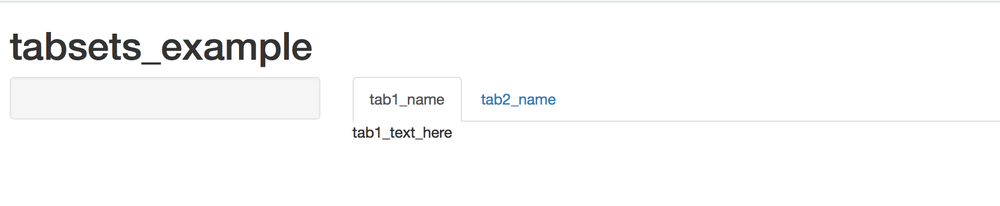

Using tabs is a good way to organize multiple outputs. 

This blog is going to show you __how to create the tabset layout__ 
that looks like the image above with simple steps.

The code below used for demonstration can be found [__here__](https://github.com/lindaYuelingLai/shinyapp_tabsets/tree/master).


## In server.R

As always, you have output variables in server.R file. 

Note: For simplicity,the example code here produces simple text output. 
The example is just to give you an idea.
You may produce any other types of output by using other render functions 
(e.g. renderPlot( ), renderTable( ), etc.)

```{r, eval=FALSE}
  output$tab1 <- renderText({
    "tab1_text_here"
  })
  output$tab2 <- renderText({
    "tab2_text_here"
  })
```


## In ui.R

To create a tabset, in your __mainPanel( )__ function in ui.R, you need
to call the tabset function: __tabsetPanel( )__.
Then under this function, you call function 
__tabPanel(__ _{tab_name}_, _{output_function}_ __)__ for every tab you want to create.
The first parameter in the function is the name of the tab,
the second parameter in the function is the function you use for output.

Note: For simplicity, the example code here is for text output. 
You may produce any other types of output by using other output functions.
(e.g. plotOutput( ), tableOutput( ), etc.)
```{r, eval=FALSE}
  # a tabset layout that includes two tabs 
  mainPanel(
    tabsetPanel(
      tabPanel("tab1_name", textOutput("tab1")),
      tabPanel("tab2_name", textOutput("tab2"))
    )
  )
```


### Congratulations! 
Now you're done adding a tabset in the shinyapp.
You can see the tabset layout when you run your app.

